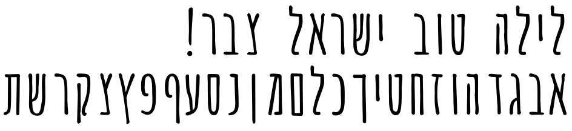
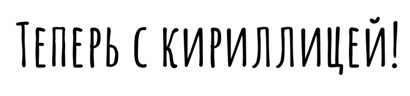

# Amatic SC

A fun font for fun people!
Amatic began as an offshoot of the popular Amatic SC family by Vernon Adams. 
Ben Nathan, an Israeli designer, added a Hebrew component and adjusted the Latin in many ways, particularly to widen the letter-spacing to better fit the Hebrew.

Amatic now speaks Cyrillic with glyphs drawn by calligrapher Eugene Spizhovy.

